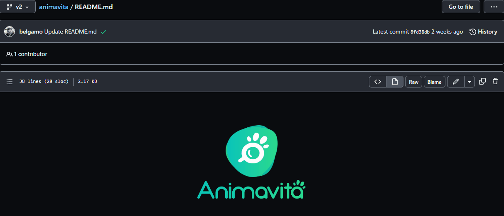

# Projeto com README
Um projeto de teste com um arquivo README༼ つ ◕_◕ ༽つ

## Tecnologias utilizadas
- HTML
- CSS
- JS
- ScreenToGif

## Como utilizar

1 - Clone pro o projeto
...
git clone <url>
...

2 - Acesse a pasta do projeto
...
cd repositorio-com-readme
...